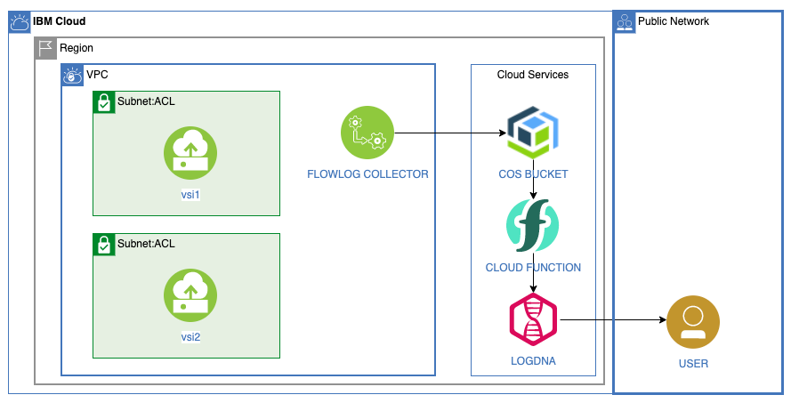

# Analyze VPC Flow Logs using LogDNA

[Flow logs for VPC](https://cloud.ibm.com/vpc-ext/network/flowLogs) store metadata for the network traffic in Virtual Private Clouds, VPC in Cloud Object Storage (COS) buckets.

[Cloud Functions](https://cloud.ibm.com/functions) can be extended by [integrating with Cloud Object Storage (COS)](https://cloud.ibm.com/docs/openwhisk?topic=cloud-functions-pkg_obstorage). The COS trigger type lets you run custom code logic when a new object is stored, updated, or deleted from a designated bucket in COS. 

This project shows how use a trigger function to read a flow log COS object and write it to [LogDNA](https://cloud.ibm.com/observe/logging).



1. The Flow logs for VPC are written to a COS bucket.
1. Cloud Object Storage sends an event to Cloud Functions.
1. This event triggers a log action to write LogDNA entries.

## Deploy the project

> The scripts do not check permissions. You must ensure you have the right permissions:
> - to create service instances,
> - to create Cloud Functions namespaces (you need to be an Administrator on the Functions service)
> - to create vpc resources

1. To run the following scripts use the IBM cloud shell.  It has the pre-requisites already installed.
Or use your own computer and make sure to install:
   * [IBM Cloud CLI](https://cloud.ibm.com/docs/cli?topic=cloud-cli-install-ibmcloud-cli)
   * Cloud Object Storage plugin. Install it with `ibmcloud plugin install cloud-object-storage`.
   * Cloud VPC infrastructure plugin. Install it with `ibmcloud plugin install vpc-infrastructure`.
   * Cloud Functions plugin. Install it with `ibmcloud plugin install cloud-functions`.
   * [Terraform and the IBM Provider](https://cloud.ibm.com/docs/terraform?topic=terraform-getting-started)
   * [jq](https://stedolan.github.io/jq/) command line utility

1. Copy the configuration file and set the values to match your environment. At a minimum, set or review the values for `PREFIX`, `RESOURCE_GROUP_NAME`, `REGION`, `TF_VAR_ssh_key_name` and `TF_VAR_ibmcloud_api_key`

   ```sh
   cp template.local.env local.env
   ```

1. Load the values into the current shell.

   ```sh
   source local.env
   ```

1. Ensure you have the prerequisites to run the scripts and initialize the ibmcloud cli.

   ```sh
   ./000-prereqs.sh
   ```

1. Create Cloud Object Storage and LogDNA services.

   ```sh
   ./010-create-services.sh
   ```

   If they do not already exist, the script creates:
      * a Cloud Object Storage service instance and a service key,
      * a storage bucket
      * a LogDNA service instance and a service key.

   The previously defined `PREFIX` variable is used to define the names of these resources.

1. Create the action and the trigger.  The python action requires modules that are not provided by the default Cloud Function environment.  It is required to [Package multiple Python files into a .zip file](https://cloud.ibm.com/docs/openwhisk?topic=openwhisk-prep#prep_python_pkg).  If you are using the cloud shell, great!  If not it requires a `pip install virtualenv` into a python3 environment to use the `virtualenv` command to create tne virtualenv directory to put in the zip.  The script runs this in docker, but you can run the `actions/virtualenv_init.sh` by hand on your computer to avoid using docker (if you do not mind installing virtualenv on your computer).

   ```sh
   ./020-create-functions.sh
   ```

1. Create a VPC with two instances and a Flow Log collector for the vpc.  The vsi1 is public.  The vsi2 is private and only accesible from vsi1.  For a full explination see TODO BLOG POST

   ```sh
   ./030-create-vpc.sh
   ```

## Cleanup

To delete the services and Cloud Functions artifacts, run:

   ```sh
   ./040-cleanup.sh
   ```
