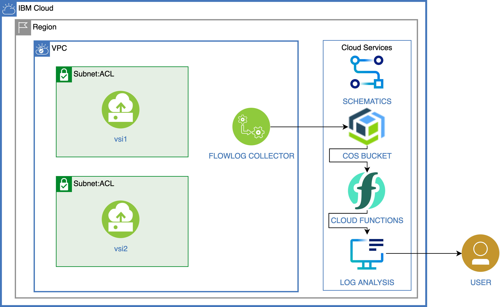

# Analyze VPC Flow Logs

[Flow logs for VPC](https://cloud.ibm.com/vpc-ext/network/flowLogs/vpc) persists a digest of network traffic in a Virtual Private Clouds, VPC in a Cloud Object Storage (COS) bucket.

[Code Engine](https://cloud.ibm.com/codeengine/overview) can be extended by [integrating with Cloud Object Storage (COS)](https://cloud.ibm.com/docs/codeengine?topic=codeengine-subscribe-cos-tutorial). The COS trigger type lets you run custom code logic when a new object is stored, updated, or deleted from a designated bucket in COS. 

This project shows how use a trigger function to read a flow log COS object and write it to [IBM log analysis](https://cloud.ibm.com/observe/logging).



1. The Flow logs for VPC are written to a COS bucket.
1. Cloud Object Storage sends an event to Cloud Engine.
1. This event triggers a code engine execution to read the bucket and write log entries.

## Deploy the project

> The scripts do not check permissions. You must ensure you have the right permissions:
> - to create service instances,
> - to create Code Engine resources: projects, applications, ...
> - to create vpc resources
> - to create a schematics workspace

todo need to check cloud shell
1. To run the following scripts you can use the IBM cloud shell.  It has the pre-requisites already installed.
Or use your own computer and make sure to install:
   * [IBM Cloud CLI](https://cloud.ibm.com/docs/cli?topic=cloud-cli-install-ibmcloud-cli)
   * Cloud Object Storage plugin. Install it with `ibmcloud plugin install cloud-object-storage`.
   * Cloud VPC infrastructure plugin. Install it with `ibmcloud plugin install vpc-infrastructure`.
   * Code Engine plugin. Install it with `ibmcloud plugin install code-engine`.
   * [jq](https://stedolan.github.io/jq/) command line utility

1. Login.  The login expires after about an hour, if you see failures you may need to login again.
   ```
   ibmcloud login
   ```

1. Copy the configuration file and set the values to match your environment. At a minimum, set or review the values for `PREFIX`, `RESOURCE_GROUP_NAME`, `REGION` and `TF_VAR_ssh_key_name`.

   ```sh
   cp template.local.env local.env
   edit local.env
   ```

1. Load the values into the current shell.

   ```sh
   source local.env
   ```

1. Ensure you have the prerequisites to run the scripts and initialize the ibmcloud cli.

   ```sh
   ./000-prereqs.sh
   ```

1. Choose either step 1 or step 2 below (not both).  Step 1 is if you already have a vpc.  Step 2 will create a demo vpc.  The blog post describes interacting with the demo.
  1. If you aleady have a VPC that will work as well, just follow the instructions to [create a flow log collector](https://cloud.ibm.com/docs/vpc?topic=vpc-ordering-flow-log-collector&interface=ui).  Initialize the code_engine.env file using the template_code_engine.env as an example
  1. ./010-create-demo.sh will create a demo environment with a VPC, Cloud Object Storage instance, bucket with flow logs enabled.  020-demo-environment.sh will extract the code_engine.env file contents required for the next step.
   ```sh
   ./010-create-demo.sh
   ./020-demo-environment.sh
   ```
1. 

TODO left off here

   If they do not already exist, the script creates:
      * a Cloud Object Storage service instance and a service key,
      * a storage bucket
      * a log analysis service instance and a service key.

1. Create the action and the trigger.  The python action requires python modules that are not provided by the default Cloud Function environment.  It is required to [Package multiple Python files into a .zip file](https://cloud.ibm.com/docs/openwhisk?topic=openwhisk-prep#prep_python_pkg).  If you are using the cloud shell, great!  If not it requires a `pip install virtualenv` into a python3 environment to use the `virtualenv` command to create tne virtualenv directory to put in the zip.  The script runs this in docker, but you can run the `actions/virtualenv_init.sh` by hand on your computer to avoid using docker (if you do not mind installing virtualenv on your computer).

   ```sh
   ./020-create-functions.sh
   ```

1. Optionally create a VPC with two instances in the vpc and put the vpc id into the file vpcid.txt.  The vsi1 is public.  The vsi2 is private and only accesible from vsi1.  For a full explanation see the [blog post](https://www.ibm.com/cloud/blog/use-ibm-log-analysis-with-logdna-to-analyze-vpc-network-traffic-from-ibm-cloud-flow-logs-for-vpc).

   ```sh
   ./030-create-vpc.sh
   ```

1. if you skipped the previous optional step put your existing vpc id into vpcid.txt:

   ```sh
   cat vpcid.txt
   ./035-flow-log-create.sh
   ```


## Cleanup

To delete the services and Cloud Functions artifacts, run:

   ```sh
   ./040-cleanup.sh
   ```

## Download the flowlog files

See [actions](./actions) for a python based cli tool to download the flow logs and test out the code.
